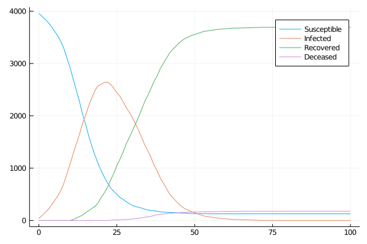
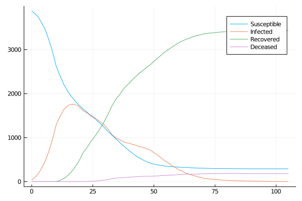
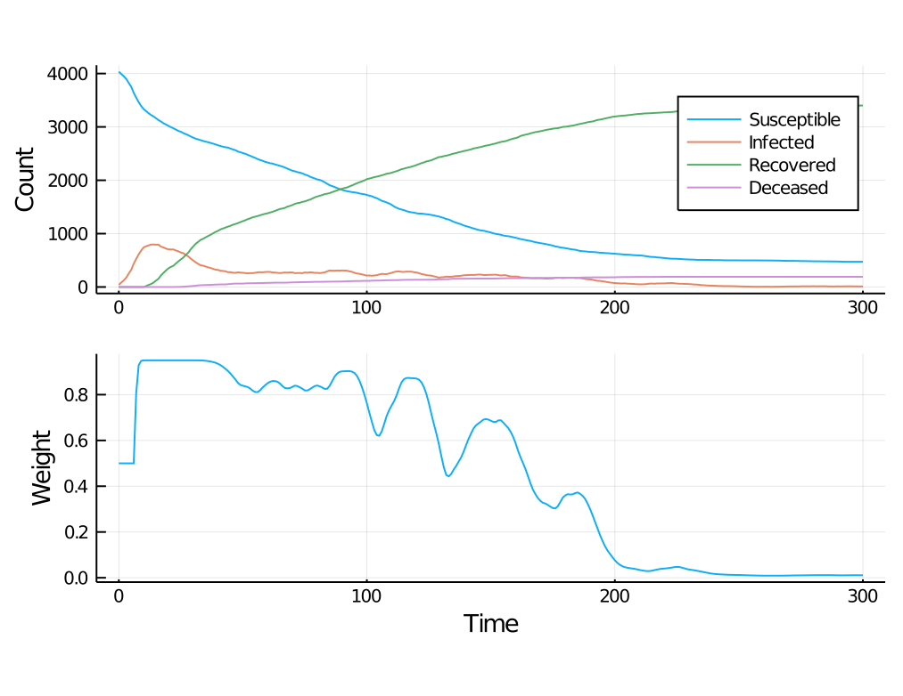

# COVID.jl

Julia package for agent-based modeling of COVID-19 outbreaks and possible intervention strategies.

## Installation
This package can be installed via Julia's package manager. From the Julia REPL, type `]` to enter Pkg REPL mode, and then execute
```julia
pkg> add https://github.com/IgorDouven/COVID.jl
```
## Basic usage
To use default parameter setting:
```julia
using COVID

params = ParameterSetting()
```
This sets the values of eight parameters:
- `max_tspan` (type: `Int`): maximum duration of infection, by default equal to 24;
- `pr_quick_rec` (type: `Float64`): the proportion infected that recover in `max_tspan`/2 days, by default .5;
- `trans_rate` (type: `Float64`): transmission rate, by default .04;
- `drop` (type: `Int`): by how much the infectiousness drops if the infection last longer than half of `max_tspan`, by default 4;
- `pr_death` (type: `Float64`): probability of death of an infected agent, by default .1;
- `N` (type: `Int`): number of households, by default 1000;
- `λ` (type: `Float64`): probability that two nodes are connected, by default 1.25 percent;
- `hhs` (type: `Float64`): average household size, by default 4.

The default settings can be changed. For instance, to change the maximum duration of infection, `max_tspan`, to 20 days and the average household size, `hhs` to 6.5, enter
```julia
params = ParameterSetting(max_tspan = 20, hhs = 6.5)
```
Similarly for the other parameters.

**NB** (if you are new to Julia): The types of the various parameters have to be respected. So if, for instance, you want to set the average household size to 6 (but leave the other parameters at their default value), enter this as `ParameterSetting(hhs = 6.)`.

Here, `N`, `λ`, and `hhs` are used to set up an Erd&ouml;s-R&eacute;nyi graph. One can easily change this by going into the source code, in particular the file `COVID_FNCS.jl`, and changing the function `create_model`. The package `LightGraphs.jl` offers several alternatives to an Erd&ouml;s-R&eacute;nyi graph, which can be plugged into the said function.

To let a model update for 100 days, assuming that the probability that agents will stay home on any given day rather than visit one of their contacts equals .4, use
```julia
res = run_model(params, .4, 100)
```

Assuming the settings of the example, the following plots the infected and recovered (which includes the deceased) at all 100 time steps:
```julia
cvd_plot(res)
```


If one would like to see a full SIRD output (so also plotting the susceptibles and showing separately the really recovered and the deceased), run
```julia
cvd_plot(res, sird=true)
```


To study the effect of changing the probability of staying at home, one can do, for instance,
```julia
switch_pts = repeat([(.3, 10), (.9, 15), (.6, 10)], outer=3) 
res = run_model(params, switch_pts)
```
which updates the model during 10 steps assuming a probability of .3, followed by 15 steps assuming a probability of .9, followed by 10 steps assuming a probability of .6, and this repeated thrice. This yields the following result:


## Flexible lockdowns
We closely monitor the trend in the number of new daily infections and accordingly adjust the weight (the probability that people will stay home rather than go out to visit someone in their network). In this system of 'flexible lockdowns', there are two free parameters, the size of the sliding window used for the local regressions, and the scaling factor, which scales the local regression coefficient to adjust the weight. In the example below, we use the same model parameters as above and assume a scaling factor of 0.025 and a window size of 6 to update the model for 300 time steps:
```julia
res = run_model(params, .025, 6, 300)
```

We can again plot the outcome using
```julia
cvd_plot(res, sird=true)
```

which yields the following result:



## Evolutionary computing
To find the Pareto-optimal solutions to the question of which window size and which scaling factor to use, we recruit an evolutionary algorithm, more exactly the NSGA-II algorithm (N. Srinivas & K. Deb, 1994, "Multiobjective Optimization Using Nondominated Sorting in Genetic Algorithms," _Evolutionary Computing_, **2**, pp. 221-48). The objective functions to jointly minimize are:
1. number of direct deaths;
2. undercapacity of critical care;
3. suppression of social (and consequently economic) activity.

Each agent (i.e., proposed solution) is scored in light of these criteria on five consecutive runs of `numb_updates` units of time. The fittest agents are selected for the next generation, which consists of them and the offspring they are allowed to have (a parent population of _N_ agents will bring forth _N_ children).

Evolutionary algorithms are computationally costly, so it is recommend to make full use of parallel computing (which is easy to do in Julia). The following runs the NSGA-II algorithm for 15 generations, starting with a parent population of 24 (meaning that a generation&mdash;parents + children&mdash;will consist of 48 agents), and the tests are conducted on the basis of 150 updates:

```julia
using Distributed
addprocs()
@everywhere using COVID

@everywhere params = ParameterSetting()

run_evo(params, 150, 15, 24)
```

This outputs the Pareto-optimal solutions. One can also obtain the full information about each generation (agent properties as well as scores) by running `run_evo(params, 150, 15, 24, full=true)`.

&#x26A0; The above code took over two hours to finish on a 24-core machine.
